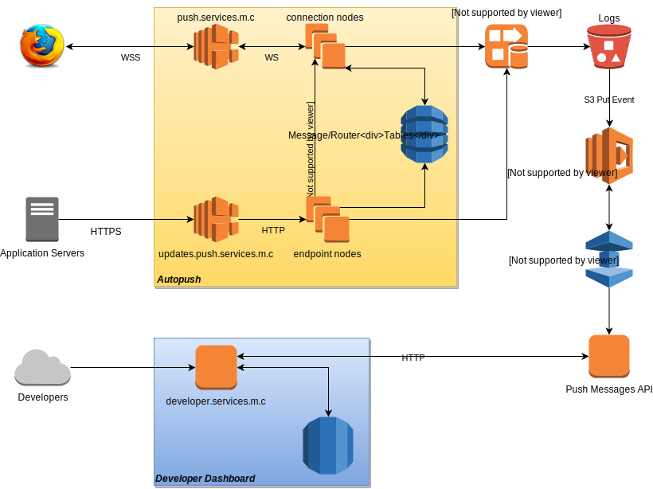

# Mozilla Push Service

Mozilla Push Service is the server-side project supporting Push Notifications in
[Firefox][ffx] and [Firefox OS][fxos]. The current server is
[autopush](https://github.com/mozilla-services/autopush). You can
learn how to use the web based API to push messages to web
applications running Push by reading the [autopush HTTP API
document](https://autopush.readthedocs.io/en/latest/http.html).

## Architecture

## Code

The current production deployment of Push is a Python-based websocket server
named **autopush**, developed on Github. The Push Service team has several
repositories for development of the Push Server, and supporting tooling.

- [autopush](https://github.com/mozilla-services/autopush) - Push connection
  and endpoint server
- [push-processor](https://github.com/mozilla-services/push-processor) -
  Backend Push log processor to extract developer registered message metadata
  for the Developer Dashboard
- [push-messages](https://github.com/mozilla-services/push-messages/) - API app
  to register developer public-keys for the processor to extract and return
  recent cached message metadata for the Developer Dashboard
- [push-dev-dashboard](https://github.com/mozilla-services/push-dev-dashboard) -
  Developer Dashboard to view recent Push message activity and register for
  developer Push services
- [push_setup](https://github.com/mozilla-services/push_setup) - Full-Stack AWS
  setup using CloudFormation for a complete or partial Push deployment
- [ap-loadtester](https://github.com/mozilla-services/ap-loadtester/) - Load and
  end-to-end Push testing application

See the [architecture](#architecture) image for reference on what components
each of these code pieces correspond to.

Older versions of the server (also known as "legacy") are provided
here purely for historical and educational reasons.

- [pushgo](https://github.com/mozilla-services/pushgo) - Legacy
  Go-based Push server (no longer developed or deployed)
- [push-tester](https://github.com/bbangert/push-tester) - SimplePush load
  tester (no longer developed)

## People and Places

* [Ben Bangert](https://github.com/bbangert) - Engineering (San Francisco, UTC-8)
* [JR Conlin](https://github.com/jrconlin) - Engineering (Mountain View, UTC-8)
* [Kit Cambridge](https://github.com/kitcambridge) - Engineering (Mountain View, UTC-8)
* [Philip Jenvey](https://github.com/pjenvey) - Engineering (San Francisco, UTC-8)
* [Richard Pappalardo](https://github.com/rpappalax) - QA (Mountain View, UTC-8)
* [Jeremy Orem](https://github.com/oremj) - Operations (Portland, UTC-8)
* [Chris Karlof](https://github.com/ckarlof) - Identity Services Manager (San Francisco, UTC-8)

We meet for a weekly stand-up, as well as a larger meeting on
Wednesdays to discuss Push specification details and client coordination.

Additional ways to get in contact with the team:

* The [Push mailing list](http://groups.google.com/a/mozilla.com/group/push/)
* The `#push` channel on [Mozilla IRC](https://wiki.mozilla.org/IRC)

## Sending Push Messages

If you are interested in using WebPush for your application, there are
a number of resources that should help.

If you are adding Push to your browser or progressive enhancement
application, see [Using the Push
API](https://developer.mozilla.org/en-US/docs/Web/API/Push_API/Using_the_Push_API)
on MDN.

If you are creating a service that sends Push messages to remote
browser applications, see [HTTP Endpoints for
Notifications](https://autopush.readthedocs.io/en/latest/http.html).

## Terminology

The Push Service uses a range of terminology that can be difficult at first to
keep straight. This is a list of commonly used terms and phrases with their
meaning in the context of Push.

For an overview of how these terms fit together to deliver a push message to a
user-agent, [see the Firefox Push Notification high-level
diagram](https://wiki.mozilla.org/Firefox/Push_Notifications#Technologies). This
page also includes descriptions of related technologies that help to deliver a
cohesive Push Notification experience.

Where applicable, these match the [Webpush Spec Terminology][wpst].

Application
: Both the sender and ultimate consumer of push messages. Many applications
  have components that are run on a user agent and other components that run on
  servers.

Application Server
: The component of an application that runs on a server and requests the
  delivery of a push message.

Channel ID
: Legacy terminology for a Push Message Subscription utilized by SimplePush and
  the websocket client protocol.

Endpoint
: A REST-ful HTTP URL uniquely associated with a Push Message Subscription. This
  is referred to as a "push resource" in the [WebPush specification][wp].

Push Message Subscription
: A message delivery context that is established between the user agent and the
  push service and shared with the application server.  All push messages are
  associated with a push message subscription.

Push Message
: A message sent from an application server to a user agent via a push service.

Push Message Receipt
: A message delivery confirmation sent from the push service to the application
  server.

Push Service
: A service that delivers push messages to user agents.

SimplePush
: Firefox OS specific Push system that carries no data, only an incrementing
  version number. The Mozilla Push Service continues to support this legacy API
  for Firefox OS devices.

UAID
: A globally unique UserAgent ID. Used by the Push Service to associate clients
  utilizing the websocket protocol with their associated channel ID's. This
  string is always a UUID.

User Agent
: A device and software that is the recipient of push messages.

WebPush
: IETF specification regarding Push Messages, the protocol for their delivery
  (HTTP 2.0) to User Agents, and how the Application Server interacts with the
  Push Service. [See the complete Webpush Specification][wp].

## Alternate Implementation

Other groups have implemented Push Services implementing SimplePush and/or
WebPush.

- [Aerogear Unified Push Server](
https://github.com/aerogear/aerogear-unifiedpush-server)

## Community Contributions

[Matthias Wessendorf](https://gist.github.com/matzew) has provided [a quick
hack](https://gist.github.com/matzew/cbda360d72eaaef75971) showing how to call
the server by hand.

Sebastian Blanc provides a [handy video showing how to send messages to mobile
devices](https://www.youtube.com/watch?v=PpPNSu2ENUA) and a Raspberry Pi using SimplePush.

[wpst]: https://tools.ietf.org/html/draft-ietf-webpush-protocol-01#section-1.1
[wp]: https://webpush-wg.github.io/webpush-protocol/
[fxos]: https://www.mozilla.org/en-US/firefox/os/
[ffx]: https://www.mozilla.org/en-US/firefox/
